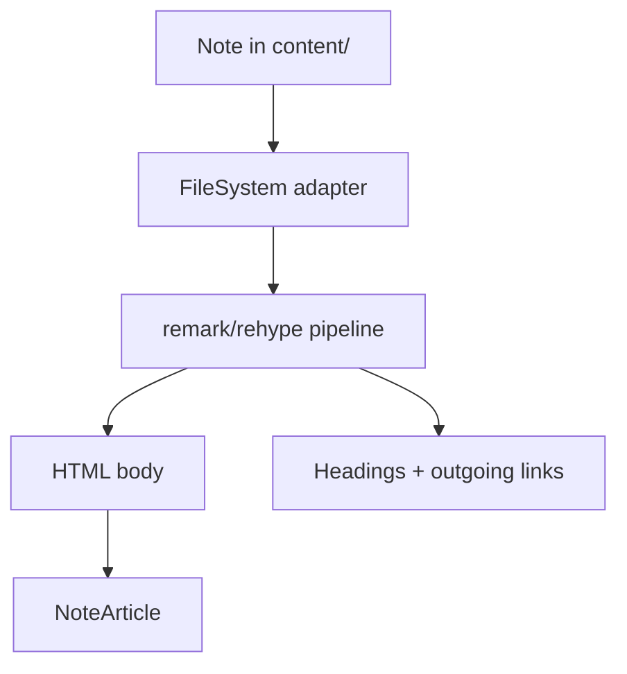
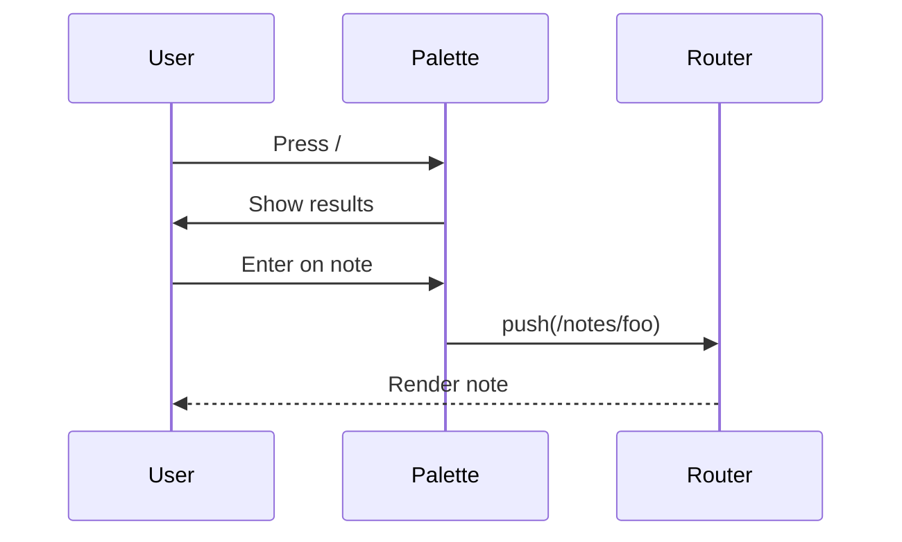
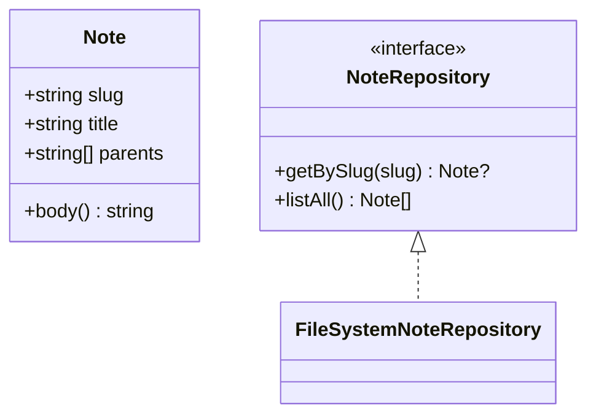

This note exercises every renderer the template supports. Open it after a clone or a `git pull upstream` to confirm everything still works. It doubles as a copy-paste reference for the syntax of each feature, and it ends with a checklist.

## Inline formatting

This paragraph contains **bold text**, *italic text*, ***bold italic***, `inline code`, ~~strikethrough~~ (GFM), and an autolinked URL https://example.com. A trailing aside in a paragraph should still flow naturally, with no blank line required between this sentence and the next.

A second paragraph follows immediately, with a regular [external link](https://anthropic.com) and an inline `code span` that should pick up the `--primary` accent.

## Wiki links

Resolved by title: [[Deep Modules]].
Bare-target link via slug: [the deep-modules idea](deep-modules), auto-converted because the URL has no slashes, dots or protocol.
Display alias: [[Deep Modules|see the deep-modules idea]].
Unresolved target: [[Some Note That Does Not Exist]], which should render in the broken style.

> Note: `[text](Two Words)` with a space inside the parentheses is **not** valid Markdown. CommonMark forbids spaces in the URL portion of an inline link. Use `[[Two Words]]` instead, or stick to slug form like `[text](two-words)`.

Hover any of the ones that resolve to see the note preview pop up.

## Callouts

Obsidian's callout syntax renders as a typed blockquote. Four accent families are recognised, and an unfamiliar type still looks deliberate rather than unstyled.

> [!note] With a title
> The title is optional. Written as `> [!note] With a title`.

> [!tip]
> Green: `tip`, `hint`, `success`, `check`, `done`.

> [!warning] Careful
> Amber: `warning`, `caution`, `attention`.

> [!danger] Stop
> Red: `danger`, `error`, `bug`, `failure`.

> [!wat] Unrecognised type
> Falls back to the muted accent instead of rendering unstyled.

## Comments

Obsidian comments are stripped before anything downstream sees them, so they reach neither the page, the search index nor the markdown mirrors. %%This sentence is inside a comment and should be invisible. If you can read it, the strip pass has broken.%% The gap in this paragraph is where it was.

## Headings and the table of contents

Open the right panel's contents view (`T`) and check that every heading below appears at the right depth.

### Third-level heading

#### Fourth-level heading

##### Fifth-level heading

###### Sixth-level heading

## Lists

Unordered:

- First item
- Second item with a [link to Deep Modules](deep-modules)
- Nested list:
  - Sub-item A
  - Sub-item B with **bold** content
- Third item

Ordered:

1. Step one
2. Step two
3. Step three

Task list (GFM):

- [x] A completed item
- [ ] An open item
- [ ] Another open item

## Code blocks

Inline `useEffect(() => fetch(url))` is highlighted as plain inline code.

A fenced TypeScript block with syntax highlighting:

```typescript
interface Note {
  slug: string
  title: string
  parents: string[]
}

function isEpic(note: Note): boolean {
  return note.parents.length === 0
}

const example: Note = {
  slug: 'template-reference',
  title: 'Template Reference',
  parents: ['Reference'],
}
```

A Bash block (different language label):

```bash
# clone and run
git clone https://github.com/y9vad9/onvu.git my-site
cd my-site
npm install
npm run dev
```

A plain block with no language:

```
+----------+      +----------+
|  source  | ---> |  target  |
+----------+      +----------+
```

## Blockquote

> A module is **deep** when it provides a lot of functionality through a small interface.
> The Unix file I/O system is the canonical example: five system calls cover an enormous amount of complexity.
>
> Paraphrased from John Ousterhout.

## Tables

| Feature          | Status | Notes                        |
| ---------------- | ------ | ---------------------------- |
| Syntax highlight | Yes    | Shiki via rehype-pretty-code |
| Wiki links       | Yes    | `[[Target]]` and `[X](X)`    |
| Callouts         | Yes    | `> [!note] Title`            |
| Mermaid          | Yes    | Renders client-side          |
| Math (KaTeX)     | Yes    | `$inline$` and `$$block$$`   |
| Footnotes        | Yes    | GFM                          |

## Math

Inline math: $E = mc^2$ should render alongside text without breaking the flow.

Block math:

$$
\frac{\partial f}{\partial x} = \lim_{h \to 0} \frac{f(x + h) - f(x)}{h}
$$

A more interesting expression:

$$
\sum_{i=0}^{n} i = \frac{n(n+1)}{2}
$$

## Mermaid diagrams

A simple flowchart:



A sequence diagram:



A class-ish diagram:



## Images

A single image with rounded corners and click-to-zoom:


A co-located image, written as a relative path next to this `.md` file. The pipeline copies it to `/notes-assets/` and emits responsive WebP variants, and it previews in any markdown editor:


The same file through Obsidian's embed syntax, `![[sample-colocated.png]]`, which is what a pasted screenshot produces:

![[sample-colocated.png]]

An inline image flows with the text at roughly the size of a glyph. Append `?inline` to the URL: that went about as well  as you would expect.

An image-only table renders as a carousel. Scroll it horizontally:

| | | |
|---|---|---|
|  |  |  |

## Footnotes

Markdown supports footnotes via GFM[^1]. A second reference here[^2] should land at the bottom.

[^1]: This is the first footnote text.
[^2]: This is the second footnote, which supports **inline formatting** and `code` too.

## Long passage for scroll testing

The remaining paragraphs exist so the article overflows the viewport and the scroll mechanics have something to act on: the contents panel highlighting the active section, hash anchor jumps, search-result auto-scroll, the reading-progress bar.

Lorem ipsum dolor sit amet, consectetur adipiscing elit. Mauris a velit non quam tincidunt fermentum. Curabitur sit amet rhoncus risus. Quisque hendrerit luctus ipsum. Phasellus pellentesque pellentesque odio, eget faucibus tellus aliquam at.

Sed eget viverra purus, vel commodo enim. Vivamus rhoncus ante non tellus consectetur, ac dignissim erat suscipit. Nam ac arcu et augue posuere ultricies. Praesent sed lobortis libero. Aenean blandit imperdiet ante, in fermentum sem rhoncus a.

### A nested heading deep in the article

This heading exists to verify that the contents panel's active item updates as you scroll past it, and that the hash anchor `#a-nested-heading-deep-in-the-article` jumps to it correctly when followed.

Suspendisse potenti. Donec convallis, ligula sit amet placerat porttitor, justo nulla scelerisque eros, eu pharetra sapien sapien et leo. Etiam quis facilisis lectus. Maecenas viverra arcu sed orci sodales, in tempus ipsum semper.

## Validation checklist

- [ ] Every heading appears in the contents panel at the right depth, h1 through h6
- [ ] Code blocks show the language label and the copy button
- [ ] Mermaid diagrams render (three above)
- [ ] Math renders, inline and block
- [ ] Wiki links pop a preview on hover, and broken ones are styled differently
- [ ] All four callout accents differ, and the unrecognised type is muted
- [ ] The comment section above has no visible text in it
- [ ] The `![[sample-colocated.png]]` embed renders an image, not a stray `!`
- [ ] The inline image sits on the text baseline rather than in its own paragraph
- [ ] Image lightbox opens on click, and Escape closes it
- [ ] The carousel scrolls horizontally
- [ ] Search highlights and auto-scrolls on `?q=...&hit=...`
- [ ] The reading-progress bar grows as you scroll
- [ ] Footnotes render at the bottom and link back to the reference
